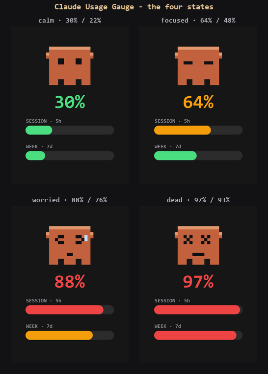

# Claude Usage Gauge

A tiny desk gadget that shows your **live Claude token usage** as pixel art. A pixel
Claude creature sits on a 2" round-cornered screen; its face goes from calm → focused →
worried → dead-eyed as you burn through your usage, and two color-by-fill bars track your
rolling **5-hour session** and **7-day week**.

Colour means exactly one thing — **how close you are to your own redline**:
🟢 green `< 50%` · 🟠 amber `50–80%` · 🔴 red `> 80%`. It's a *vibe gauge*, not an official
fuel gauge: Anthropic doesn't publish real limits, so the thresholds are personal estimates
you set yourself.



*Browser-simulator render (1:1 with the 240×320 panel). The on-device photo/GIF lands once the board arrives.*

> **Status (honest):** firmware + a 1:1 browser simulator are complete; **on-device
> bring-up is pending** — flashing the real board, confirming the LCD pins, and capturing
> the demo. No "it works" claim until there's a photo/GIF of it actually running. The
> browser preview is pixel-identical to the panel and is what the screenshots show.

## How it works

```
~/.claude/projects/**/*.jsonl   (Claude Code already writes these)
        │  usage.py  — sums message.usage tokens, no API/login
        ▼
   bridge.py  — turns tokens into session% / week% vs your redlines
        │  USB serial  "session,week\n"  @115200
        ▼
   ESP32-S3  — firmware/ draws the creature + bars on the LCD
```

There are **two ways to run it**:

1. **Browser preview** (no hardware) — `preview.html` is a 1:1 simulator of the real
   240×320 panel. Great for tuning the design.
2. **Real device** — flash `firmware/` to the board and run `bridge.py`.

## Hardware

- **Waveshare ESP32-S3-Touch-LCD-2** — 2.0" 240×320 IPS, ST7789T3 driver, ESP32-S3R8
  (8MB PSRAM / 16MB flash), USB-C. (~$20)
- A **USB-C data cable** (not charge-only).

## Run the browser preview

```bash
py server.py          # serves http://localhost:8780
```
Open it, and use the redline boxes + state buttons to see every face.

## Flash the device

Requires [PlatformIO](https://platformio.org/).

```bash
cd firmware
pio run -t upload         # build + flash (hold BOOT if it won't enter download mode)
```
Then start the data bridge on the PC:
```bash
pip install pyserial
py bridge.py COM5         # use your board's serial port
```

> **Pins & bring-up:** the LCD GPIOs live in `firmware/src/pin_config.h`. Online sources
> disagree on them, so the build is **fail-closed** — it won't compile until you copy the
> verified pins from Waveshare's official Arduino demo for this board and uncomment
> `#define PINS_VERIFIED`. On boot it runs a timed colour-bar **self-test** you inspect by
> eye: clean R/G/B/W bars = bus + pins right; a black/garbled screen = a wrong pin. (Visual
> check, not an automated gate.) The gauge UI draws right after.

## Design notes

- **Data honesty:** the gauge tracks Claude's real limit *types* — a rolling **5-hour
  session** and a rolling **7-day week** — not a made-up "hourly" number. It never claims
  to know Anthropic's actual limits; the redlines are yours.
- **Color = closeness, nothing else.** No rainbow gradients; the whole fill is one colour
  that means "how close to the line."
- **The face is the glance.** You read the creature's expression from across the room
  before you read any number.

Tune the redlines in one place — the two constants at the top of `preview.html`
(`SESSION_BUDGET_TOKENS`, `WEEKLY_BUDGET_TOKENS`) and the matching ones in `bridge.py`.

## Repo layout

| File | What it is |
|------|------------|
| `usage.py` | Reads `~/.claude` logs, sums tokens (stdlib only). |
| `server.py` | Local web server for the browser preview. |
| `preview.html` | 1:1 browser simulator of the 240×320 screen. |
| `bridge.py` | PC → board serial bridge (live data). |
| `firmware/` | PlatformIO project for the ESP32-S3. |

## License

MIT — see [LICENSE](LICENSE).
